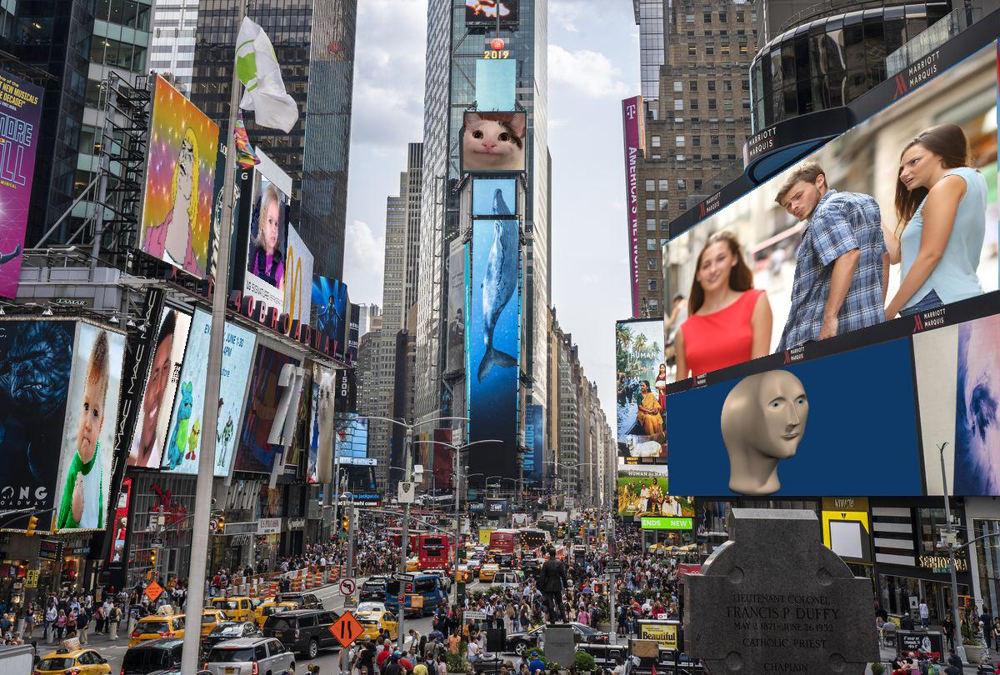
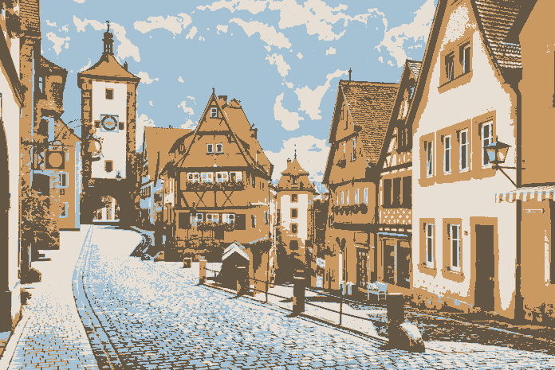
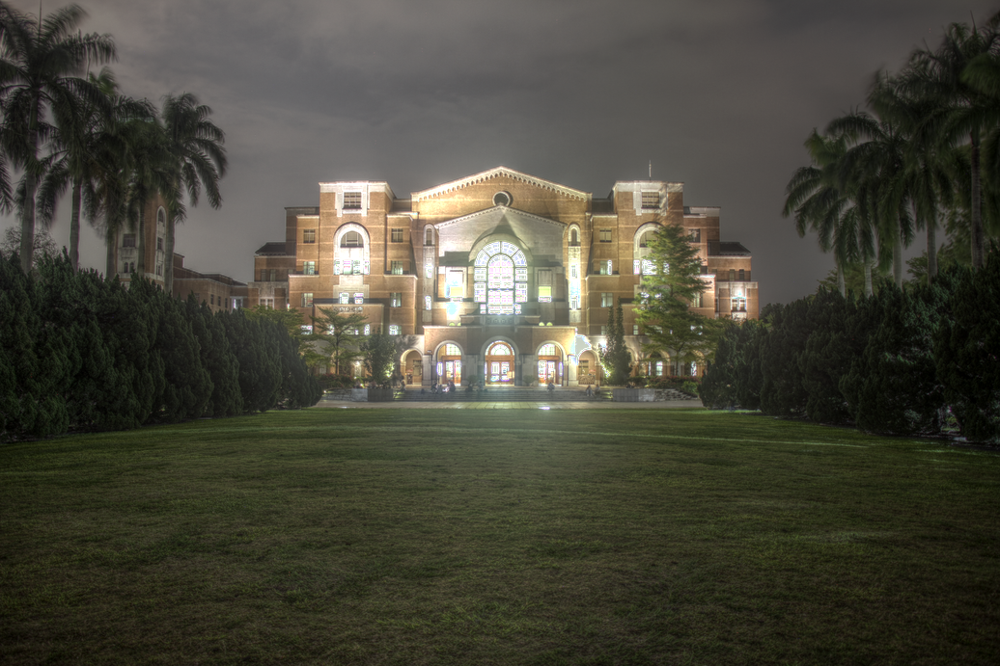
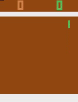
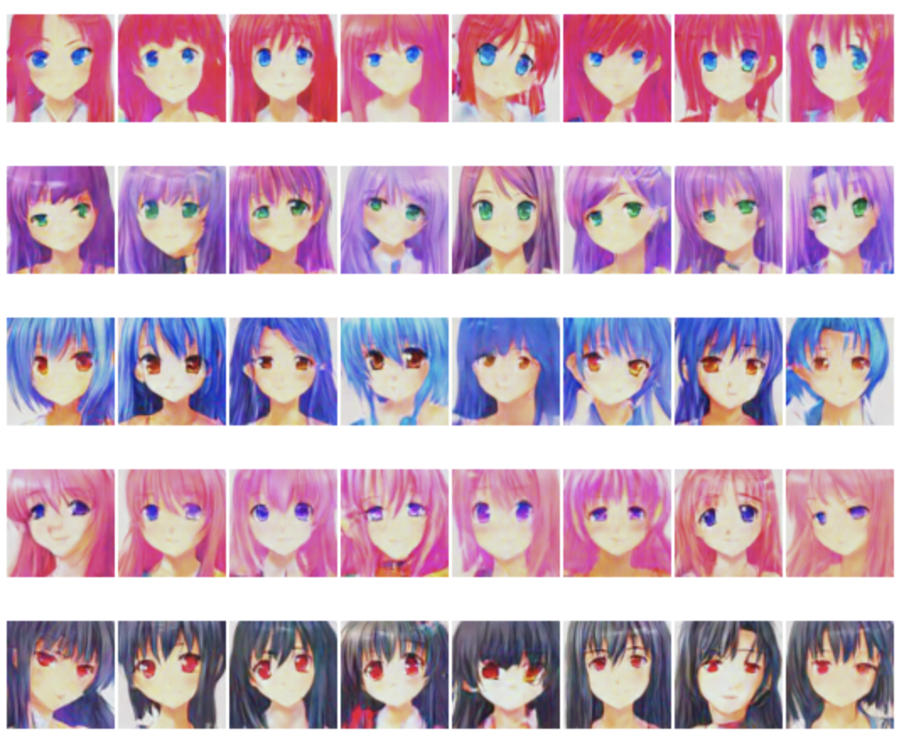
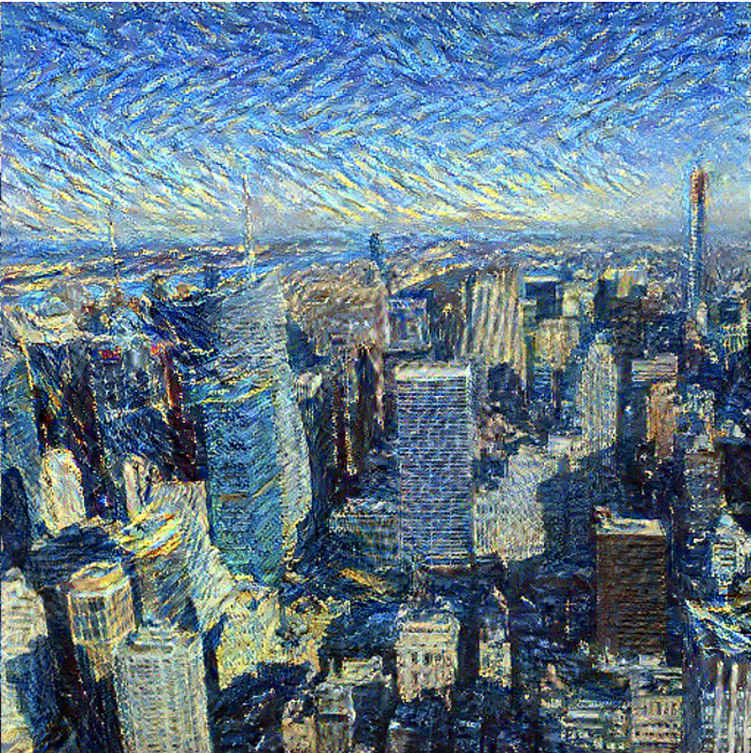
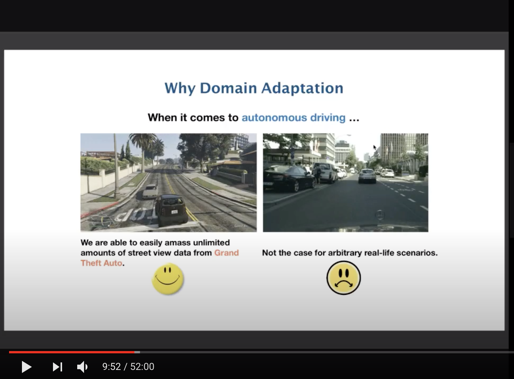

I am a senior undergraduate researcher at National Taiwan University. My research interest lies in the intersection of computer graphics and 3D vision. I am particularly focused on the **Multimodality for 3D Representations**, aiming to learn robust features across multiple 3D representations (point clouds, mesh, multi-view images ...) through various self-supervised learning techniques.

I work under the supervision of [Prof. Yu-Chaing Frank Wang](http://www.ee.ntu.edu.tw/profile1.php?id=1060727) and [Prof. Homer Chen](https://www.ee.ntu.edu.tw/bio1.php?id=60). I've recieved NTU Presidential Award for top 5% students 4 times (Rank: 5/261), and is the recipient of the National Taiwan University Alumni Scholarship (awarded to 2 EECS students each year).

Outside of research, I spend most of my time creating open source projects, garnering over 3.9k stars on Github. I've built a [Python package with over 100k downloads](https://github.com/bchao1/bullet), a [React visualization tool](https://github.com/bchao1/chart-race-react), a [Renderer in Go](https://github.com/bchao1/go-render), and many more, most of which with a visual aspect. Checkout my work [here](https://github.com/bchao1).

- [Publications](#pub)
- [Side Projects](#project)
- [Industry Experience](#work)
- [Teaching Experience](#teach)
- [Leadership Experience](#leader)

# Publications

### [Self-Supervised Deep Learning for Fisheye Image Rectification](https://ieeexplore.ieee.org/document/9054191)
**Chun-Hao Chao** ; Pin-Lun Hsu ; Hung-Yi Lee ; Yu-Chiang Frank Wang, accepted to **ICASSP 2020**

***

# Side Projects

### `bullet`

  

[**bullet**](https://github.com/bchao1/bullet) is a scalable and fully customizable Python interactive prompts library built with a focus on aesthetics, clarity, and convenience.

- Over **100k downloads** on PyPI. This is verified by the [Google Big Query API](https://www.googleadservices.com/pagead/aclk?sa=L&ai=DChcSEwi4iOe8jqzrAhXSqZYKHbkEC2sYABABGgJ0bA&ohost=www.google.com&cid=CAESQOD2uZWdS5DCp5AVcioA82ozmPd0_GGGkaohUl6HGxTwjZ6jsDUDUjL6AL2IY6RNl_5DWaGydR0TMiPrRvfmJcI&sig=AOD64_1eKE-GEgD7kBc_WWnrpA4NybtosQ&q&adurl&ved=2ahUKEwibgt68jqzrAhXhIqYKHY1rB30Q0Qx6BAgOEAE).
- Over **2900+ stars**, **90 forks** on Github
- It has been on [Github Trending](https://github.com/trending) and has been featured on the [Python Bytes](https://pythonbytes.fm) podcast.

***

### `chart-race-react`

  

[**chart-race-react**](https://github.com/bchao1/chart-race-react) is a fully customizable React visualization tool for creating bar-chart races.

- Over **1k downloads** on npm
- Over **370 stars** on Github.

***

### `go-render`

  
  

[**go-render**](https://github.com/bchao1/go-render) is a software rasterization-based renderer written in pure Golang. It supports rendering features such as multiple shading algorithms, textures, camera, custom lighting (ambient, diffuse, spectral), and etc.

***

### `vocab`

  

[**vocabs**](https://github.com/bchao1/vocabs) is a full-fledged command line dictionary written in pure Python. It supports a wide range of operations such as querying and editing words, exporting word lists, and interactive anki-like vocabulary game.

- Over **2k** downloads on PyPI
- Over **220 stars** on Github, and has been on [Github Trending](https://github.com/trending).

***

### Image Processing Projects

  
  

  
  

- [Seam Carving](https://github.com/bchao1/seam-carving) - Exploring content-aware image resizing featured in the [SIGGRAPH 2007 paper](https://perso.crans.org/frenoy/matlab2012/seamcarving.pdf).
- [Homography](https://github.com/bchao1/homography) - A command-line tool to easily project photos onto another by computing homography.
- [Quantization](https://github.com/bchao1/quantization) - In this project, I explore a plethora of image quantization methods such as [Otsu's method](https://en.wikipedia.org/wiki/Otsu%27s_method), [Median Cut](https://en.wikipedia.org/wiki/Median_cut), [Kmeans++](https://en.wikipedia.org/wiki/K-means%2B%2B) and etc.
- [High Dynamic Range Imaging](https://github.com/bchao1/High-Dynamic-Range-Imaging) - Revisiting the OG HDR imaging algorithm proposed by [Debevec et al.](http://www.pauldebevec.com/Research/HDR/debevec-siggraph97.pdf).

***

### Machine Learning Projects

  
  

  
  

- [Pong](https://github.com/bchao1/Pong-Policy-Gradient) - I trained an AI agent to play Pong with Policy Gradient.
- [Breakout](https://github.com/bchao1/Breakout-Deep-Q-Learning) - I trained an AI agent to play Breakout with Deep-Q-Learning and experience replay.
- [Anime Generation](https://github.com/bchao1/Anime-Generation) - I trained an AI to draw anime characters with different hair styles and eye colors using ACGAN and Conditional GAN. The [custom dataset](https://github.com/bchao1/Anime-Face-Dataset) I collected was also used by many people on [Kaggle](https://www.kaggle.com/splcher/animefacedataset/notebooks) and students in NTU's [Machine Learning](http://speech.ee.ntu.edu.tw/~tlkagk/courses_ML20.html) Course.
- [Style Transfer](https://github.com/bchao1/Style-Transfer) - I trained an AI to draw like different artists using Neural Style Transfer.

***

# Industry Experience

### Google

> **Software Product Sprint Participant, Summer 2020**

  

Google's SWE internship was cancelled due to the COVID-19 outbreak. As a result, I was invited to participate in the [Google Software Product Sprint](https://buildyourfuture.withgoogle.com/programs/softwareproductsprint/).

I worked on an image-processing web application with that supports many image processing algorithms and image sharing features using Javascript, jQuery, HTML, CSS, and Flask. 

### WorldQuant

> **Quantitative Finance Research Intern, Winter 2019** 

  

I was the second undergrad sophomore to intern at [WorldQuant Taiwan](https://www.worldquant.com/home/). I worked on finding trading algorithms (*alphas*) with Python, and won the **Best Price-Volume Alpha** award.

***

# Teaching Experience

- **Machine Learning, Spring 2020** *by Prof. Hung-yi Lee* - I was in charge of the design and grading of the **[Convolutional Neural Networks](http://speech.ee.ntu.edu.tw/~tlkagk/courses_ML20.html)** project.

- **Signals and Systems, Spring 2020** *by Prof. Lin-shan Lee*

## Short talks
### Domain Adaptation Primer

In this talk, I go through the basics of Domain Adaptation and introduce both classic papers and its recent development. The talk is given at [Machine Learning, Spring 2020](http://speech.ee.ntu.edu.tw/~tlkagk/courses_ML20.html) at National Taiwan University.

***

# Leadership Experience

### Director of NTUEESA Information Department

> **August, 2019 ~ July, 2020**

I served as the **Director of Information Department** at NTUEESA (National Taiwan Unveristy Dept. of Electrical Engineering Student's Association) from August, 2019 to July, 2020. 

During my service, I lead a team of 30+ students to manage websites for NTUEE events, gave bi-weekly lectures on web development, and helped organize experience sharing receptions.

Here are some works of me and my colleagues:
- Our depository on [Github](https://github.com/NTUEEInfoDep)
- The website for [MakeNTU](https://make.ntuee.org), the largest Makeathon in Taiwan.
- Our [Guide](https://github.com/NTUEEInfoDep/Server-Guide) to our own server.
- Our lectures on [Web Development](https://github.com/NTUEEInfoDep/Web_Lecture).
- Our lectures on [Algorithms and C++ STL](https://github.com/NTUEEInfoDep/Algorithms_Lecture).
