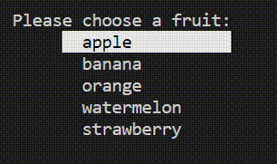
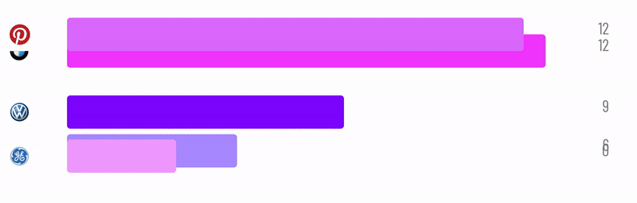

I am a senior undergraduate researcher at National Taiwan University. My research interest is unsupervised learning, especially self-supervised and contrastive learning, with its applications in computer vision and image processing applications. I work under the supervision of [Prof. Yu-Chaing Frank Wang](http://www.ee.ntu.edu.tw/profile1.php?id=1060727) of NTUEE and [Prof. Yung-Yu Chuang](https://www.csie.ntu.edu.tw/~cyy/publications/index.html) of NTUCSIE. I've recieved NTU Presidential Award for top 5% students 4 times, and is the recipient of the National Taiwan University Alumni Scholarship (awarded to 2 EECS students each year).

Outside of research, I spend most of my time creating open source projects, garnering over 3.9k stars on Github. I've built a [Python package with over 100k downloads](https://github.com/bchao1/bullet), a [React visualization tool](https://github.com/bchao1/chart-race-react), a [Renderer in Go](https://github.com/bchao1/go-render), and many more, most of which with a visual aspect. Checkout my work [here](https://github.com/bchao1).

# Publications

### [Self-Supervised Deep Learning for Fisheye Image Rectification](https://ieeexplore.ieee.org/document/9054191)
**Chun-Hao Chao** ; Pin-Lun Hsu ; Hung-Yi Lee ; Yu-Chiang Frank Wang, accepted to **ICASSP 2020**

# Side Projects

### `bullet`

  

[**bullet**](https://github.com/bchao1/bullet) is a scalable and customizable Python interactive prompts library built with an aesthetic focus with over **100k downloads** on PyPI and **2.9k+ stars** on Github. It has been on [Github Trending](https://github.com/trending) and has been featured on the [Python Bytes](https://pythonbytes.fm) podcast.

### `chart-race-react`

  

[**chart-race-react**](https://github.com/bchao1/chart-race-react) is a React visualization tool for creating bar-chart races with **1k+ downloads** on npm and **370+ stars** on Github.

### `go-render`

  

[**go-render**](https://github.com/bchao1/go-render) is a software rasterization-based renderer written in pure Golang. It supports basic rendering features such as shading, textures, camera, lighting.

### `vocab`

  

[**vocabs**](https://github.com/bchao1/vocabs) is a full-fledged command line dictionary written in pure Python. It has **2k+** downloads on PyPI, **220+ stars** on Github, and has been on [Github Trending](https://github.com/trending).